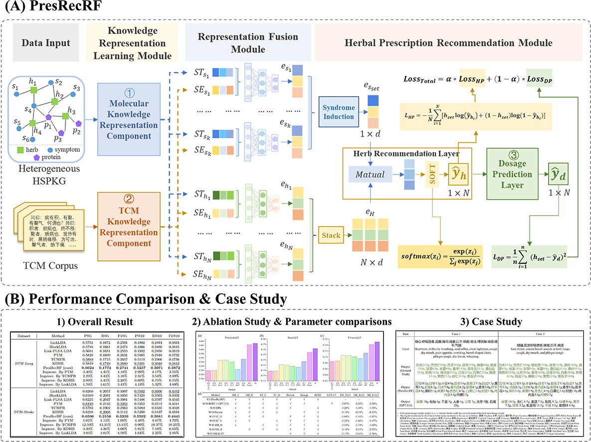

# PresRecRF: Herbal prescription recommendation via the representation fusion of large TCM semantics and molecular knowledge

## 1. Introduction

This repository contains source code and datasets for "[PresRecRF: Herbal prescription recommendation via the representation fusion of large TCM semantics and molecular knowledge](https://doi.org/10.1016/j.phymed.2024.156116)". 

In this study, we proposed a novel herbal **Pres**cription **Rec**ommendation model with the **R**epresentation **F**usion of large TCM semantics and molecular knowledge (termed PresRecRF, See graphical abstract figure below). 
The entire process of the proposed PresRecRF model closely mirrors the actual diagnosis and treatment procedures carried out by doctors, which are better applied in real clinical scenarios.

## 2. Overview



Fig1. Framework of PresRecRF. The model integrates large-scale TCM semantics and molecular knowledge for enhanced representation. PresRecRF comprises three key modules, namely knowledge representation learning, representation fusion, and prescription recommendation with precise herbal dosages. 
This approach seeks to enhance patient characterization and achieve precise herbal prescription recommendations.

## 3. Install Python libraries needed
```bash
$ conda create -n presrecrf_env python=3.9
$ conda activate presrecrf_env
$ pip install -r requirements.txt
```

## 4. Basic Usage
### (1) dataset
The relevant data required by the model are uniformly placed in the "data" folder. This folder contains the following data files:
<li><b>Lung_case.xlsx</b>: Example dataset. This dataset originates from the work of 
<a href="https://academic.oup.com/jamia/article/31/6/1268/7643677?login=true"> Dong et al. JAMIA 2024 </a>, and has been augmented with herb dosage information to form the dataset used in this study. 
Due to data privacy concerns, we cannot publicly release the complete dataset. For research purposes, please contact the corresponding author Xin Dong at <a> x_dong@bjtu.edu.cn </a>. </li> 
<li><b>Semantic_BERT</b> and <b>Semantic_LLM</b>: Initial vectors for semantic features. Semantic_BERT contains vector representations of symptoms and herbs trained through TCM BERT, while Semantic_LLM stores vector representations of symptoms and herbs generated by ChatGPT-3.5.</li> 
<li><b>Structural_Network</b>: Initial vectors for structural features. Contains vector representations of symptoms and herbs obtained through HSPKG training in this study.</li>

### (2) main code
The python script file of the model is shown in this project, including the following files:
<li><b>main.py</b>: Run the entire program (based on the Lung_case dataset)
<li><b>model.py</b>: Model-related programs
<li><b>utils.py</b>: Some related utility functions
<li><b>parameter.py</b>: Parameter-related programs

### (3) result
After running the "main.py" file, the model's Top@K performance metrics on the test set will be generated. The results are saved as log files in the "./log/" directory.

## 5. Citation and Contact

If you find PresRecRF useful for your research, please consider citing the following paper:

```
Yang K, Dong X, Zhang S, Yu H, Zhong L, Zhang L, Zhao H, Hou Y, Song X, Zhou X. PresRecRF: Herbal prescription recommendation via the representation fusion of large TCM semantics and molecular knowledge. Phytomedicine. 2024 Oct 1; 135: 156116.
```

```
@article{yang2024presrecrf,
  title={PresRecRF: Herbal prescription recommendation via the representation fusion of large TCM semantics and molecular knowledge},
  author={Yang, Kuo and Dong, Xin and Zhang, Shuhan and Yu, Haibin and Zhong, Liqun and Zhang, Lei and Zhao, He and Hou, Yutong and Song, Xinpeng and Zhou, Xuezhong},
  journal={Phytomedicine},
  volume={135},
  pages={156116},
  year={2024},
  publisher={Elsevier}
}
```

<b>If you have better suggestions or questions about our work, please contact us: <a>x_dong@bjtu.edu.cn</a> and <a>kuoyang@bjtu.edu.cn</a>. </b> 

<b>Welcome to follow our project on GitHub: <a>https://github.com/2020MEAI </a> and <a> https://github.com/xdong97 </a>. </b>
